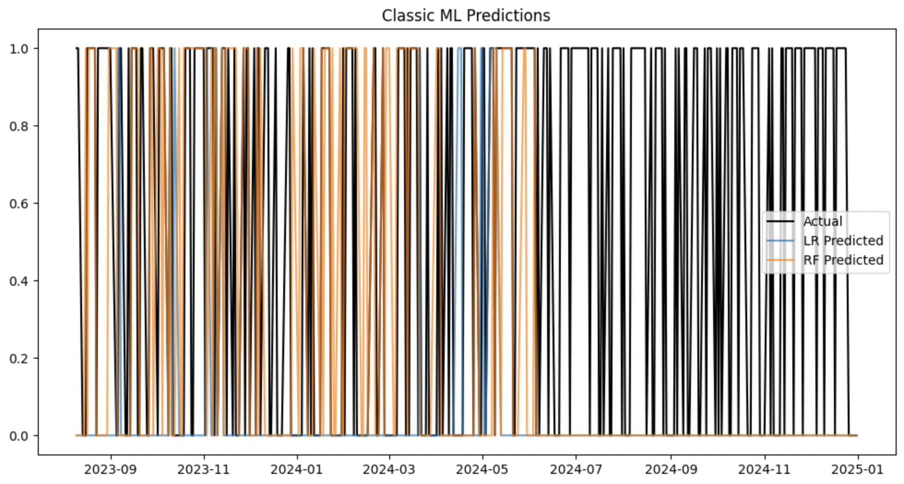
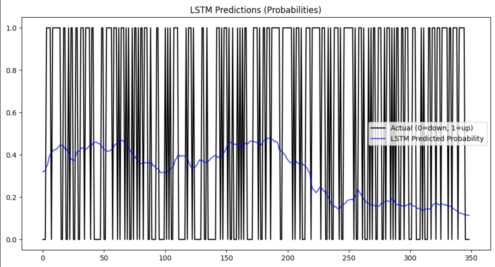

# Stock Price Movement Predictor

This project predicts whether a stock’s price will **go up or down the next day** using:
- **Classic Machine Learning** (Logistic Regression, Random Forest)
- **Deep Learning** (LSTM for sequential patterns)

It demonstrates **feature engineering, machine learning, deep learning, and visualization** in Python.

---

## Features
- Fetches historical stock data with [Yahoo Finance](https://pypi.org/project/yfinance/).
- Creates financial features:
  - Daily returns
  - Moving averages (5-day, 10-day)
- Builds and evaluates:
  - Logistic Regression (baseline ML)
  - Random Forest (ensemble ML)
  - LSTM (deep learning for time-series)
- Evaluates models with accuracy, confusion matrix, and classification reports.
- Plots:
  - Actual vs. predicted movements (ML models)
  - LSTM predicted **probabilities vs. actual labels**

---

##Example Results

### Classic ML (Logistic Regression & Random Forest)


- X-axis: trading dates  
- Y-axis: `0 = down`, `1 = up`  
- Black line = actual  
- Colored lines = predictions  

---

### Deep Learning (LSTM)


- X-axis: test sequence index  
- Black line = actual labels (0/1)  
- Blue line = predicted probability (0–1 range)  
- Flat predictions may indicate class imbalance or the need for more features/epochs.  

---

## Installation

Clone the repo:

```bash
git clone https://github.com/yourusername/stock-price-predictor.git
cd stock-price-predictor

